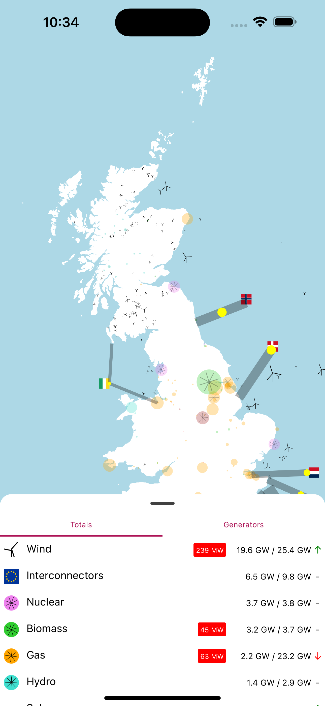

# kilowatts open source, live balancing market app
This first-of-its kind, open source React Native app (for web and ios/android) provides live, second-by-second information on the output of different generators on the UK grid. 

## Mobile Apps

[Android Beta]('https://play.google.com/store/apps/details?id=com.benjaminwatts.kilowatts')
[iOS Beta](https://testflight.apple.com/join/ZRfgNtsL')

## Website
[Link](https://gb.kilowatts.io)

Deployment Status: 

## React Native

    

## Unit/E2E Javascript Testing

Tests can either be run:

1. `yarn test` - on a unit basis -- TBC
2. `yarn e2e` - on an end to end basis -- TBC

## Building for Devices

The app is built locally using Expo (this could be moved to expo CI/CD). Build will not work without access to a working Expo account and/or signing credentials, you can set these up following the docs here `https://docs.expo.dev/build/introduction/.` 

Note that if using a different Expo account, the configuration in `app.json` will need updating.

On iOS, the build targets `internal` distribution, so devices must be enrolled to the account using `eas device:create` or manually using UDID.

A production release without developer tools is built.

1. `yarn build:android`. This outputs to `outputs/prod.apk`. You can run this on a connected usb device using `yarn android:device`
2. `yarn build:ios`. This outputs to `outputs/prod.ipa`.
3. `yarn build:cloud`. This builds in the cloud using eas instead.

# Data Attribution
All data in this app is sourced from the wonderful Elexon insights API `https://bmrs.elexon.co.uk/api-documentation`. Many thanks to the awesome team there for their continued hard work.
