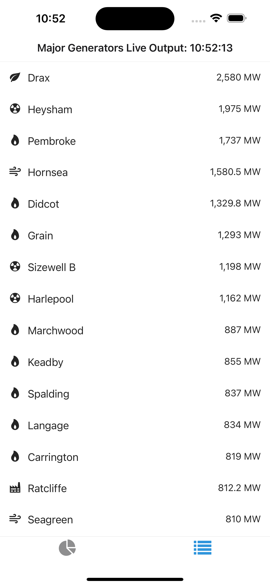
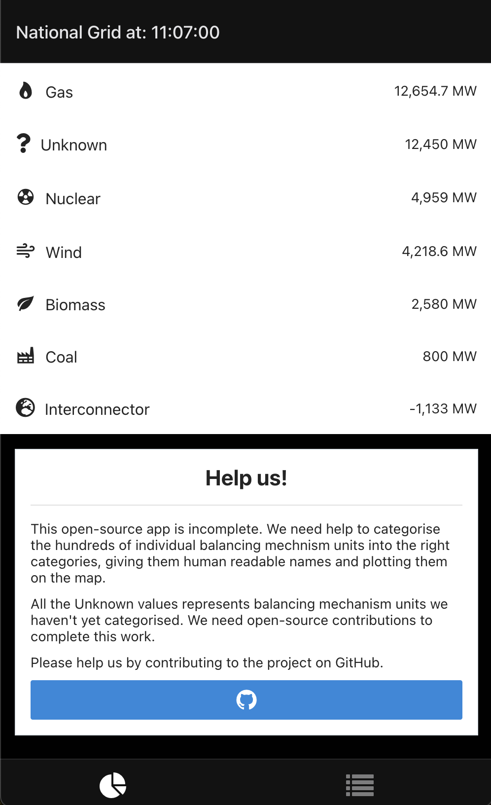
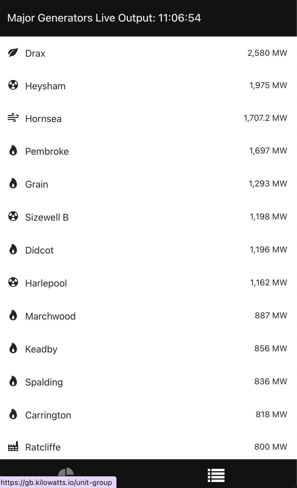
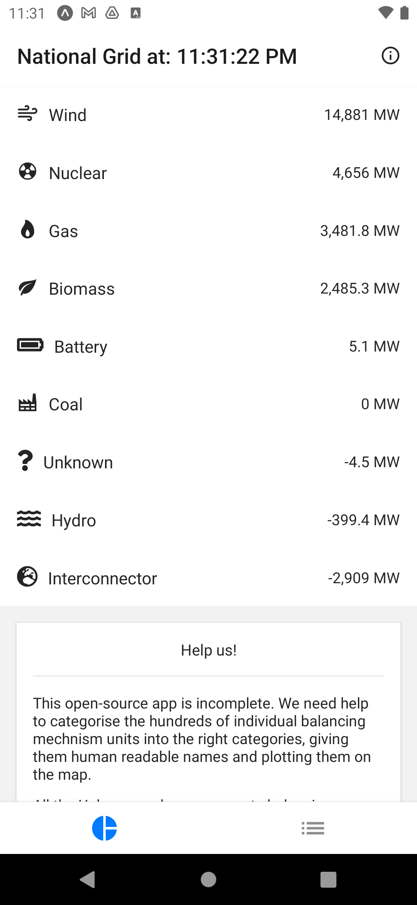
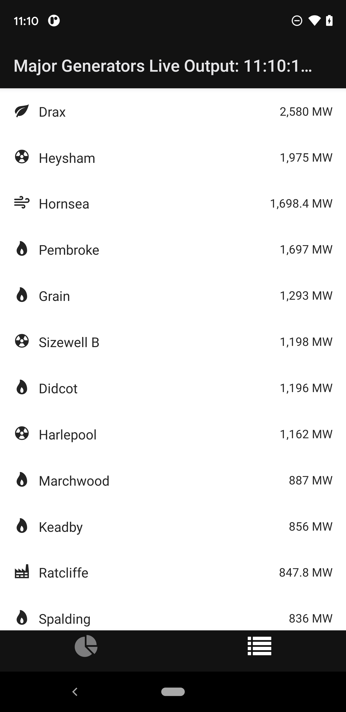

# kilowatts open source, live balancing market app
This first-of-its kind, open source React Native app (for web and ios/android) provides live, second-by-second information on the output of different generators on the UK grid. 

# Help wanted

We need help improving our list of generators displayed in the app. In particular, we need:

1. Help giving user-friendly names instead of Elexon codes (like `T-LAGA-1`)
2. Help grouping individual units of power stations (like Hornsea 1 and 2) so that they are grouped together
3. Help locating them on a map with lat/lng coordinates for a (TBC) awesome new map view that we're working on

## iOS

# Production Targets

## iOS

Screenshots:

    
    

    

Appstore release: TBC

## Website

[Link](https://gb.kilowatts.io)

Screenshots:

    
    

    

Deployment Status: 

## Android:

Note that the version of gradle must be manually downgraded to allow builds. In `android/gradle/wrapper/gradle-wrapper.properties`, change the version in `distributionUrl` to 7.5.1.

Screenshots:

    
    

    

Playstore release: TBC

## Unit/E2E Javascript Testing

Tests can either be run:

1. `yarn test` - on a unit basis -- TBC
2. `yarn e2e` - on an end to end basis -- TBC

## Maestro Integration Tests

First start a (reccomended) release variant/configuration build on android/ios

For android, `yarn android --variant Release`
For ios, `yarn ios --configuration Release`

Next, to run Maestro:

2. Test using `yarn maestro:{PLATFORM}`
3. Record using `yarn maestro:record:${PLATFORM}`

Note that the flow files are different on each platform owing to unusual behaviour of tabs in ios. Tip, use `maestro studio` to inspect when writing tests.

There are .mp4 recordings in the directory `assets/maestro_recordings`

## Building for Devices

The app is built locally using Expo (this could be moved to expo CI/CD). Build will not work without access to a working Expo account and/or signing credentials, you can set these up following the docs here `https://docs.expo.dev/build/introduction/.` 

Note that if using a different Expo account, the configuration in `app.json` will need updating.

On iOS, the build targets `internal` distribution, so devices must be enrolled to the account using `eas device:create` or manually using UDID.

A production release without developer tools is built.

1. `yarn build:android`. This outputs to `outputs/prod.apk`. You can run this on a connected usb device using `yarn android:device`
2. `yarn build:ios`. This outputs to `outputs/prod.ipa`.
3. `yarn build:cloud`. This builds in the cloud using eas instead.

# Data Attribution
All data in this app is sourced from the wonderful Elexon insights API `https://bmrs.elexon.co.uk/api-documentation`. Many thanks to the awesome team there for their continued hard work.
